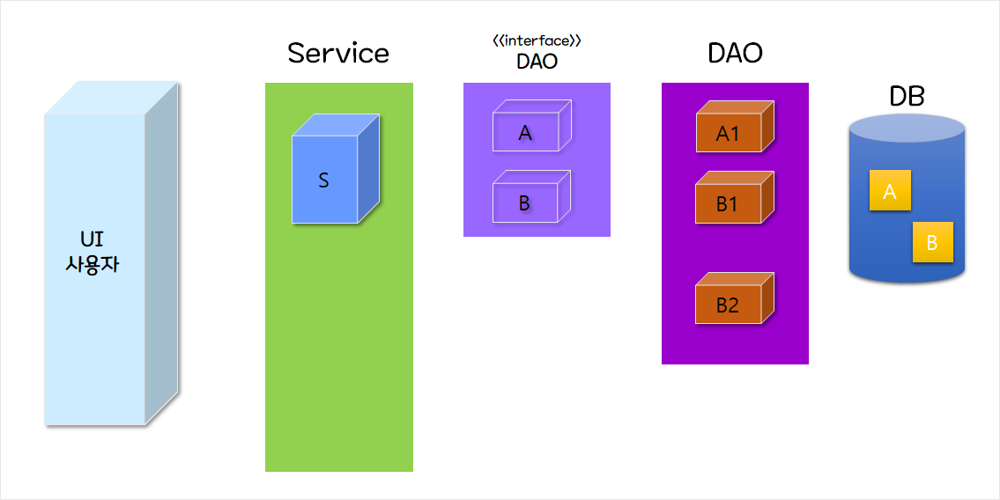

# 02 느슨한 결합력과 인터페이스

코드 수정을 없애고 DI를 위한 설정



이러한 상황을 구성한다.

B1을 사용하고 있었다.

```java
// 서비스내 코드
  private B1 b = new B1();
  b.getData();
```

B2로 변경해서 사용해야 한다

그렇다면, 서비스내 코드도 아래와 같이 변경해야 한다.

```java
// 서비스내 코드 변경
  private B2 b = new B2();
  b.getData();
```

이것은 강한 결합 이라고 본다!

변화가 일어 났을때 함께 변화해야 하기에

우리는 느슨한 결합을 통해 잦은 수정을 막고 오류도 줄여야 한다.

그래서!! **인터페이스** 코드를 둔다.

그렇다면, 서비스내 코드는

```java
  private B b = new B2();
  b.getData()
```

왼쪽을 해결하였다면!

이번에는 오른쪽! 객체 생성을 느슨하게 해보자

객체 생성 코드를 작성하지 않기 위해 우리가 해야 할일은

객체의 생성과 조립을 위한 외부 설정 파일을 만드는 것이다

**XML, Annotation** 을 활용하게 될 것이다.
